# Azure Network Watcher Tools - Comprehensive Guide

## Overview

Azure Network Watcher is a comprehensive suite of network monitoring, diagnostic, and analytics tools that help you monitor, diagnose, and gain insights into your Azure network infrastructure.

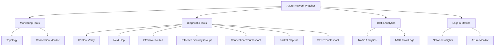

---

## 📊 Network Monitoring Tools

### 1. Topology
**Purpose**: Provides a visual representation of your Azure virtual network resources and their relationships.

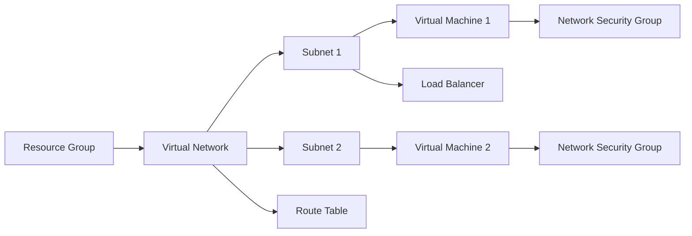

**Key Features**:
- Interactive network diagram
- Resource dependency visualization
- Real-time network state
- Export capabilities

**Use Cases**:
- Understanding network architecture
- Identifying network dependencies
- Network documentation
- Compliance and auditing

### 2. Connection Monitor
**Purpose**: Monitors network connectivity between Azure resources and provides performance metrics.

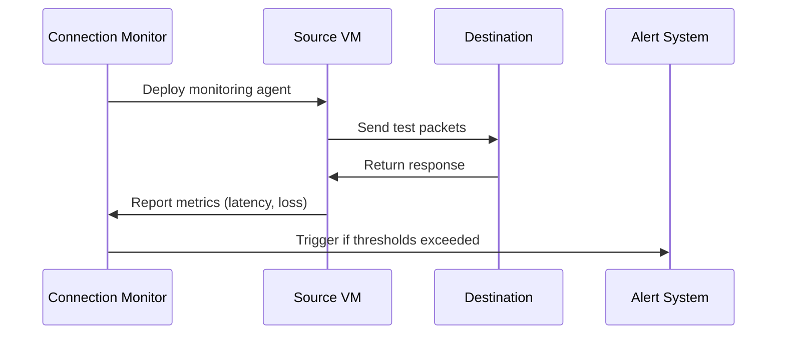

**Metrics Monitored**:
- **Latency**: Round-trip time
- **Packet Loss**: % of lost packets
- **Connectivity**: Success/failure rates
- **Jitter**: Latency variation

**Use Cases**:
- Proactive connectivity monitoring
- Performance baseline establishment
- SLA compliance monitoring
- Hybrid connectivity validation

---

## 🔧 Network Diagnostic Tools

### 3. IP Flow Verify
**Purpose**: Verifies if a packet is allowed or denied to/from a virtual machine based on security rules.

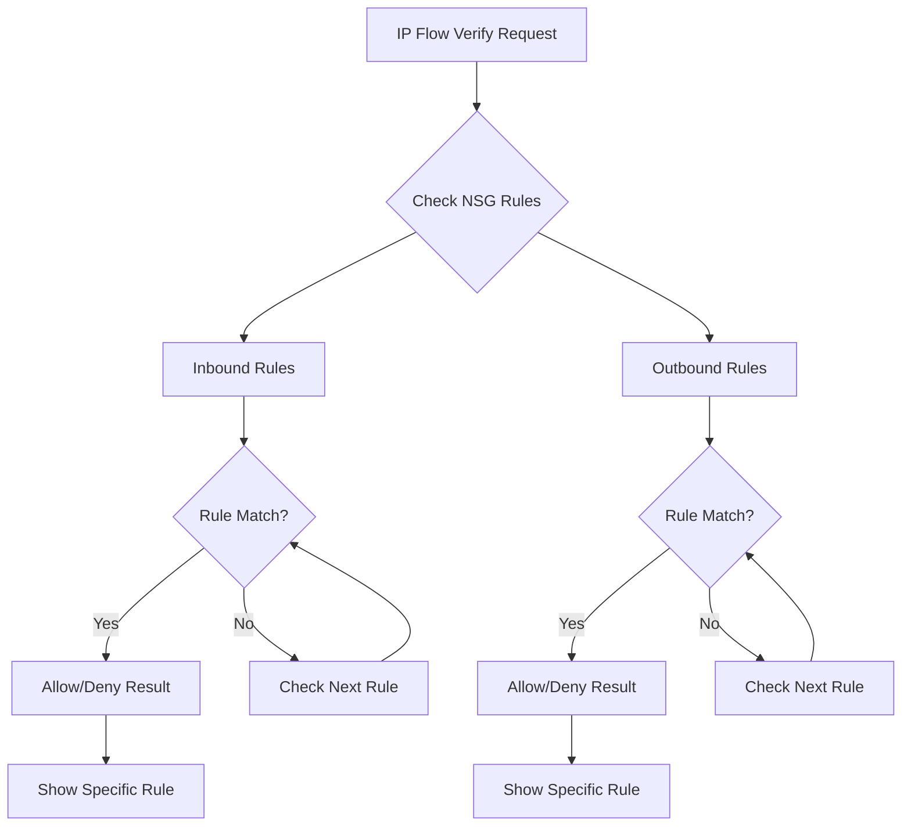

**Input Parameters**:
- Source IP and Port
- Destination IP and Port
- Protocol (TCP/UDP)
- Direction (Inbound/Outbound)

**Output**:
- Access decision (Allow/Deny)
- Specific NSG rule responsible
- Rule priority and action

### 4. Next Hop ⭐ (Related to Your Question)
**Purpose**: Determines the next hop for traffic from a VM to a specific destination.

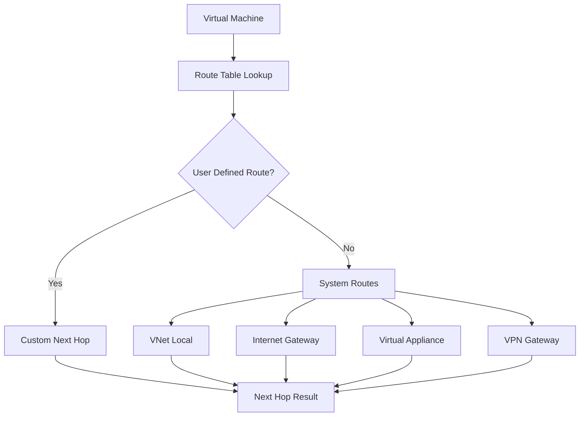

**Next Hop Types**:
- **Internet**: Traffic goes to internet
- **VirtualAppliance**: Traffic goes through NVA
- **VirtualNetworkGateway**: Traffic goes through VPN/ExpressRoute
- **VnetLocal**: Traffic stays within VNet
- **Null**: Traffic is dropped

### 5. Effective Routes ⭐ (Your Current Tool)
**Purpose**: Shows the complete routing table for a VM's network interface, including all effective routes.

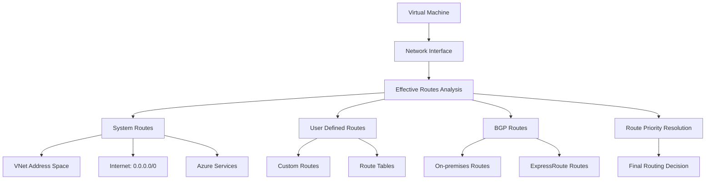

**Route Sources (Priority Order)**:
1. **User Defined Routes** (Highest priority)
2. **BGP Routes**
3. **System Routes** (Lowest priority)

**Information Provided**:
- Route source and destination
- Next hop type and IP
- Route state (Active/Invalid)
- Administrative distance

### 6. Effective Security Groups
**Purpose**: Shows all NSG rules that apply to a network interface.

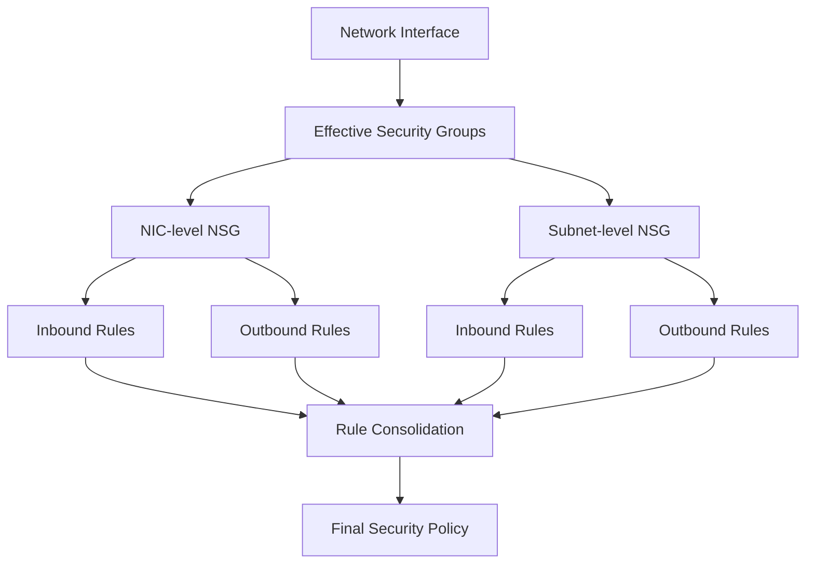

**Rule Processing**:
- Rules processed by priority (lower number = higher priority)
- First matching rule determines action
- Combines subnet and NIC-level NSG rules

### 7. Connection Troubleshoot
**Purpose**: Tests connectivity between two endpoints and diagnoses issues.

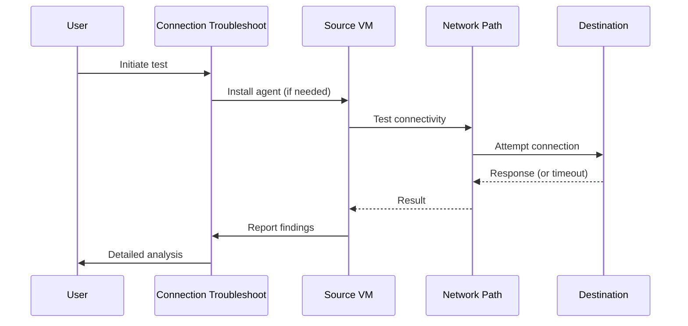

**Test Results Include**:
- Connectivity status
- Latency measurements
- Hop-by-hop analysis
- Security rule evaluation
- Routing decisions

### 8. Packet Capture
**Purpose**: Captures network packets for detailed analysis.

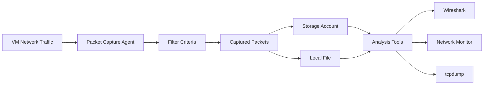

**Capture Options**:
- **Duration**: Time-based or size-based limits
- **Filters**: Protocol, IP, port-based filtering
- **Storage**: Azure Storage or local file
- **Format**: .cap files compatible with Wireshark

### 9. VPN Troubleshoot
**Purpose**: Diagnoses VPN gateway and connection issues.

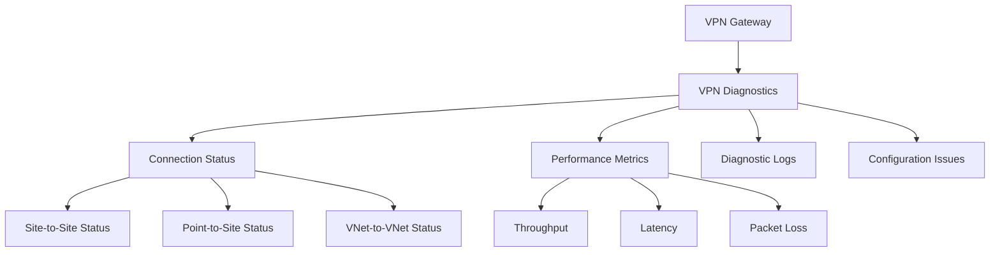

---

## 📈 Traffic Analytics & Logging

### 10. NSG Flow Logs
**Purpose**: Logs information about IP traffic flowing through Network Security Groups.

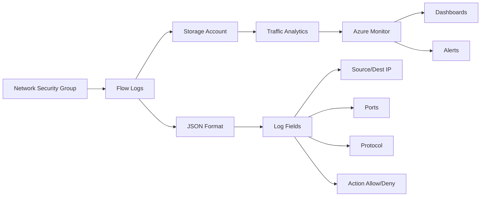

### 11. Traffic Analytics
**Purpose**: Provides insights into network traffic patterns and security threats.

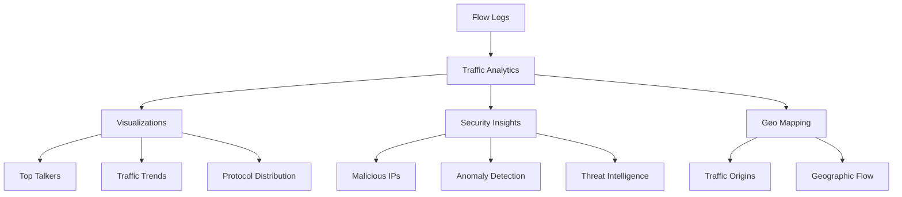

---

## 🛠️ Tool Selection Guide

### For Your Specific Scenario (VM Connectivity Issues)

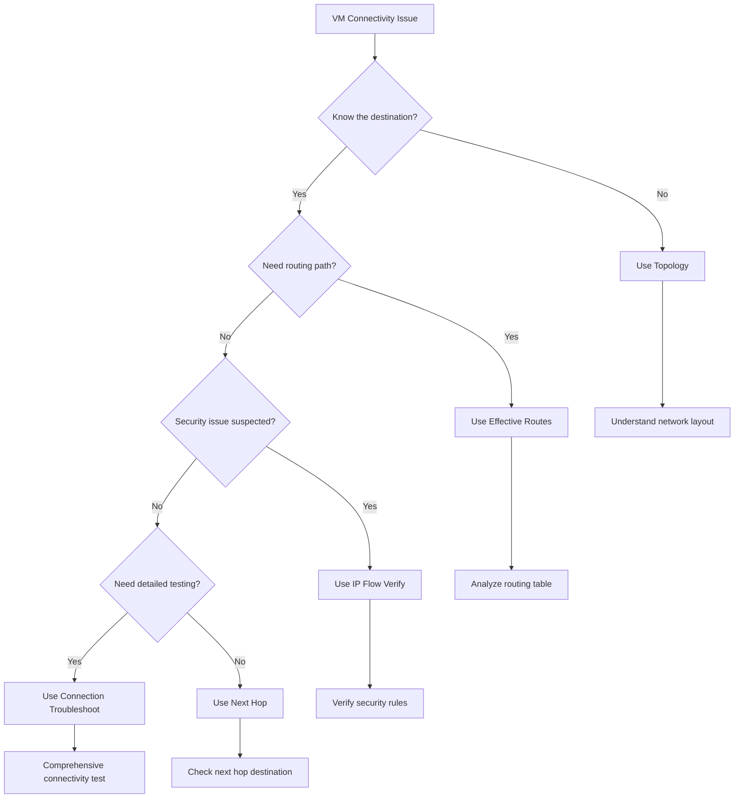

### Comparison Table

| Tool | Purpose | When to Use | Output |
|------|---------|-------------|---------|
| **Effective Routes** ⭐ | Show complete routing table | Routing conflicts, understand traffic paths | Complete route table with priorities |
| **Next Hop** | Show next destination for traffic | Quick routing verification | Next hop type and IP |
| **IP Flow Verify** | Test security rule impact | Security troubleshooting | Allow/Deny with specific rule |
| **Connection Troubleshoot** | End-to-end connectivity test | Comprehensive issue diagnosis | Detailed connectivity analysis |
| **Packet Capture** | Detailed traffic analysis | Deep packet-level troubleshooting | Network packet files |

---

## 💡 Best Practices for Your Scenario

### 1. Systematic Troubleshooting Approach

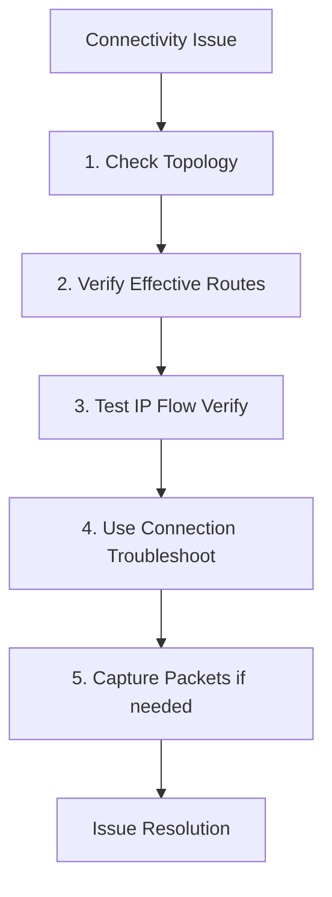

### 2. Effective Routes Analysis (Your Current Tool)

**What you should look for**:
- **Route conflicts**: Multiple routes to same destination
- **Invalid routes**: Routes marked as "Invalid"
- **Unexpected next hops**: Traffic going through wrong gateway
- **Missing routes**: No route to intended destination

**Common Issues Found**:
- User-defined routes overriding system routes
- Route propagation problems
- Overlapping address spaces
- Incorrect next hop configurations

### 3. Related Tools for Complete Analysis

After using **Effective Routes**, consider:
1. **Next Hop** - Verify specific destination routing
2. **IP Flow Verify** - Check if security rules allow traffic
3. **Connection Troubleshoot** - End-to-end validation
4. **NSG Flow Logs** - Historical traffic analysis

---

## 🎯 Quick Reference

### When to Use Each Tool

| Scenario | Recommended Tool | Why |
|----------|------------------|-----|
| "Traffic not reaching destination" | Effective Routes | See complete routing table |
| "Is traffic allowed by security rules?" | IP Flow Verify | Test specific security rules |
| "Where does this traffic go next?" | Next Hop | Quick routing verification |
| "Connection intermittently fails" | Connection Monitor | Ongoing monitoring |
| "Need detailed packet analysis" | Packet Capture | Deep packet inspection |
| "VPN connection issues" | VPN Troubleshoot | VPN-specific diagnostics |

### Pro Tips
- Always start with **Topology** to understand the network layout
- Use **Effective Routes** (like you're doing) for routing issues
- Combine multiple tools for comprehensive analysis
- Enable **NSG Flow Logs** for historical troubleshooting data

---

## 🔍 Answer to Your Specific Question

Based on your screenshot, you correctly chose **Azure Network Watcher - Effective Routes** for troubleshooting VM connectivity to an on-premises server.

### Why This Was Correct:
✅ **Shows complete routing table** for the VM's network interface  
✅ **Identifies routing conflicts** between system and user-defined routes  
✅ **Displays next hop information** for traffic to on-premises networks  
✅ **Helps detect route propagation issues** from VPN/ExpressRoute  

### Why Other Options Were Wrong:
❌ **Connection Troubleshoot**: Tests end-to-end connectivity but doesn't show routing details  
❌ **IP Flow Verify**: Tests NSG rules, not routing paths  
❌ **Next Hop**: Shows single destination routing but not the complete picture  

The **Effective Routes** tool gives you the comprehensive view needed to identify routing problems, making it the best choice for your scenario!